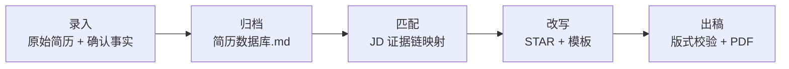

# 六秒过筛选：一份简历的流水线作业

# Six Seconds to Pass the Screen · An Agent-Native Resume Pipeline

[](https://cursor.com)
[](#)

**招聘官只给你六秒，你的简历准备好了吗？**

*Recruiters give you about six seconds. Is your resume ready for that scan?*

---

## 问题出在哪

HR 和 ATS 平均 **6–10 秒** 完成初筛。关键词不在首屏、叙事与岗位不对路，简历直接进回收站——这不是写作水平的问题，是**选材与呈现**的问题。

同一段实习经历，投 AI 产品要讲「智能体落地」，投增长要讲「数据驱动」——都是真的，但每次只能选一个主角。A4 装不下四年积累，**改简历的本质是从已验证经历里选材、重排，而不是从零创作。**

---

## 考古时代 vs. AI 润色

没有单一事实来源时，每次改岗都要重新翻 PDF、扒聊天记录、临时凑指标——细节改着改着就丢了，下次还得从零「考古」。

通用 AI 润色能把句子写漂亮，却解决不了信任：不知道改了什么、为什么改、有没有编造。面试一问细节就穿帮，省下的时间又花回去核对。

---

## 我们需要的是一条流水线，不是一次次手工作坊

按岗改稿是有效求职的前提，但完整走一遍「读懂岗位 → 选材 → 改写 → 检查」往往要 **1–2 小时**。投到第五家，大多数人退回万金油简历——不是不想认真投，是**边际成本太高**。

这套工具把流程拆成可复用的 Agent 流水线：**上游沉淀证据，下游按 JD 匹配改写**。效率交给 AI，定稿权留给你。

*What you need is a pipeline—not a fresh hand-craft job for every application.*

---

## 这套工具在做什么

**双模块 Cursor Agent Skill**：上游建弹药库，下游按 JD 打定向稿，一条龙到 PDF。

| 模块 | 角色 |
|------|------|
| [简历弹药库 · Resume Vault](resume-vault/) | 经历入库层 — 结构化归档可验证事实 |
| [过筛选改简历 · ScreenPass Resume](resume-screenpass/) | 匹配改写层 — JD 驱动选材、STAR 改写、一页 PDF |



---

### 上游：简历弹药库 · Resume Vault

**写一次，百岗可调。**

把原始简历与你确认过的事实，结构化归档成 `简历数据库.md`：STAR、量化指标、`[待确认]` 台账集中管理。只负责入库，不润色、不定向、不出 PDF——下游匹配引擎直接调用全量证据。

→ 详细说明：[resume-vault/README.md](resume-vault/README.md)

---

### 下游：过筛选改简历 · ScreenPass Resume

**六秒定生死，证据链说话。**

解析目标 JD → 驱动匹配引擎选证据 → 强匹配前置、弱相关压缩 → STAR 改写 → 版式校验 → **恰好一页 PDF**。每条 bullet 能回溯到弹药库或原始材料，面试敢讲、敢举证。

有弹药库效果拉满；没有也能跑，但每次从零考古。

→ 详细说明：[resume-screenpass/README.md](resume-screenpass/README.md)

---

## 全流程五步

```text
录入    原始简历 / 复盘文档 / 用户确认事实
  ↓
归档    resume-vault  →  简历数据库.md（结构化证据档案）
  ↓
匹配    resume-screenpass  →  JD 解析 + 证据链映射 + 匹配排序
  ↓
改写    STAR 改写 + Markdown 模板填充（Human-in-the-loop 审阅）
  ↓
出稿    版式预检 → 脚本导出 → 公司+姓名+岗位.pdf（恰好 1 页）
```

---

## 谁适合用

| 你是谁 | 为什么需要它 |
|--------|-------------|
| **多岗投递者** | 校招 / 实习 / 跳槽，每个 JD 都要定向版本，拒绝万金油硬投 |
| **经历复杂者** | 同一家公司多个并列项目，按岗切换叙事主线与压缩策略 |
| **质量洁癖者** | 拒绝 AI 编造，要脚本校验 + 证据可溯源 + 人工定稿 |
| **Cursor 重度用户** | 想把简历投递纳入可复用、可审计的 Agent 工作流 |

---

## 三条底线

- **不编造** — 缺指标标 `[待补充：指标]` 或 `[待确认]`，绝不凭空写经历
- **人工审阅** — Agent 产出须经你逐条确认，才导出终稿；AI 提案，你裁决
- **证据可溯源** — 每条表述能回溯到 `简历数据库.md` 或原始材料

---

## 怎么用

### 1. Clone

```bash
git clone https://github.com/203chenjing/resume-skills-generic.git
cd resume-skills-generic
```

### 2. 安装到 Cursor Skills 目录

| 范围 | 路径 |
|------|------|
| 项目级 | `<your-project>/.cursor/skills/` |
| 个人级 | `~/.cursor/skills/`（Windows: `%USERPROFILE%\.cursor\skills\`） |

将 `resume-vault/` 与 `resume-screenpass/` 两个文件夹复制进去。

### 3. 建弹药库

开聊：**「用 resume-vault 根据这份简历建立结构化素材库。」**

### 4. 按 JD 改写出稿

开聊：**「用 resume-screenpass 按这份 JD 执行证据链匹配改写，导出一页 PDF。」**

---

## English Overview

**Resume Vault + ScreenPass Resume** is a two-module Cursor Agent Skill pipeline for job-specific resume tailoring—built on a simple premise: tailoring is *selection and compression*, not blank-page writing.

| Module | Role |
|--------|------|
| **Resume Vault** | Ingest verified facts into `简历数据库.md`—STAR entries, metrics, and `[pending]` flags. Write once, reuse across roles. |
| **ScreenPass Resume** | Parse the JD, map evidence, rewrite in STAR format, validate layout, export a **single-page PDF**. Every bullet traces back to your vault. |

**Three principles:** no fabrication · human-in-the-loop approval · full evidence traceability.

**Quick start:** clone the repo → copy both skill folders to `.cursor/skills/` → build your vault → run ScreenPass per JD.

---

招聘官的六秒，决定你的简历进不进下一轮。你的简历，值得一条**不丢证据、不编故事**的流水线。

*Every application deserves a version of your story that fits the role—without losing the facts behind it.*

`v1.0.0`
