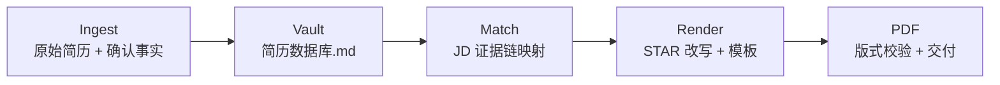

# 别再用一份简历硬投 100 岗 · 6 秒过筛选的 Agent 简历流水线

# Stop Spamming One Resume · Agent-Native Pipeline for the 6-Second Screen

[](https://cursor.com)
[](#)

---

## 先说结论

- **双模块 Cursor Agent Skill** — 上游建弹药库，下游按 JD 打定向稿，一条龙到 PDF
- **证据链可溯源** — 每条 bullet 能回溯到 `简历数据库.md`，面试敢讲、敢举证
- **Human-in-the-loop** — 不编造事实，脚本校验版式，你点头才交付

---

## 你是不是也…

HR 平均 **6–10 秒** 扫完一份简历。

关键词不在首屏？直接 pass。

每次改岗都要重新翻 PDF、扒聊天记录、临时凑指标？

通用 AI 润色是好看，但面试一问细节就穿帮。

**根因很简单：没有单一事实来源，也没有可复用的匹配引擎。**

---

## 两个产品模块

### 📦 [简历弹药库 · Resume Vault](resume-vault/)

**写一次，百岗可调。**

把原始简历 + 你确认过的事实，结构化归档成 `简历数据库.md`。

STAR、量化指标、`[待确认]` 台账 — 全在这里，下游匹配引擎直接调用。

> 只负责入库，不输出定向简历。按岗改写 → 走 ScreenPass。

---

### 🎯 [过筛选改简历 · ScreenPass Resume](resume-screenpass/)

**六秒定生死，证据链说话。**

解析目标 JD → 驱动匹配引擎选证据 → STAR 改写 → 版式校验 → **恰好一页 PDF**。

强匹配前置、弱相关压缩、结果量化加粗。过筛选，再谈面试。

> 有弹药库效果拉满；没有也能跑，但每次从零考古。

---

## 工作流 · Pipeline



```text
Ingest    原始简历 / 复盘文档 / 用户确认事实
   ↓
Vault     resume-vault  →  简历数据库.md（结构化证据档案）
   ↓
Match     resume-screenpass  →  JD 解析 + 证据链映射 + 匹配排序
   ↓
Render    STAR 改写 + Markdown 模板填充
   ↓
PDF       版式预检 → 脚本导出 → 公司+姓名+岗位.pdf（恰好 1 页）
```

---

## 3 步上手

### 1. Clone

```bash
git clone https://github.com/203chenjing/resume-skills-generic.git
cd resume-skills-generic
```

### 2. 丢进 Cursor Skills 目录

| 范围 | 路径 |
|------|------|
| 项目级 | `<your-project>/.cursor/skills/` |
| 个人级 | `~/.cursor/skills/`（Windows: `%USERPROFILE%\.cursor\skills\`） |

把 `resume-vault/` 和 `resume-screenpass/` 两个文件夹复制进去。

### 3. 开聊

- **建库：**「用 resume-vault 根据这份简历建立结构化素材库。」
- **改写：**「用 resume-screenpass 按这份 JD 执行证据链匹配改写，导出一页 PDF。」

详细玩法 → [`resume-vault/README.md`](resume-vault/README.md) · [`resume-screenpass/README.md`](resume-screenpass/README.md)

---

## 适合谁

| 你是谁 | 为什么需要它 |
|--------|-------------|
| **多岗投递党** | 校招 / 实习 / 跳槽，每个 JD 都要定向版本 |
| **经历复杂选手** | 同一家公司多个并列项目，按岗切换叙事主线 |
| **质量洁癖** | 拒绝 AI 编造，要脚本校验 + 证据可溯源 |
| **Cursor 重度用户** | 想把简历投递纳入可复用 Agent 工作流 |

---

## 信任底线

- **不编造** — 缺指标标 `[待补充：指标]` 或 `[待确认]`，绝不凭空写经历
- **你说了算** — Agent 产出须经你审阅确认，才导出终稿
- **证据可追溯** — 每条表述能回溯到 `简历数据库.md` 或原始材料
- **隐私自己管** — 示例全是虚构占位；真实材料别往公开仓库扔

---

`#Cursor` `#Agent` `#求职` `#简历` `#证据链` · v1.0.0
